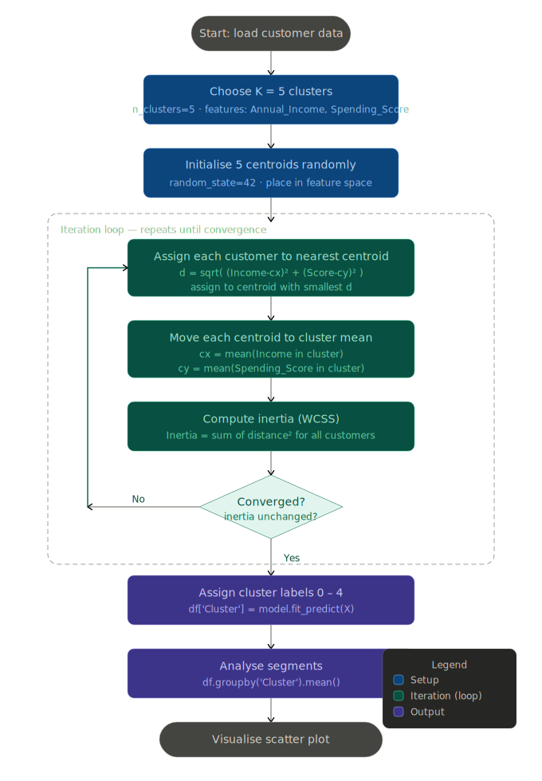
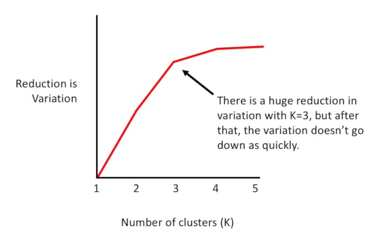

# How K-Means Works
### Tied to your Customer Segmentation Notebook

---

## What K-Means is in plain English

K-Means is an algorithm that looks at a set of data points and automatically groups them into **K clusters** — where each cluster contains points that are most similar to each other and most different from points in other clusters.

In your notebook, each data point is one customer described by two numbers — `Annual_Income` and `Spending_Score`. K-Means finds 5 natural groupings among those customers without ever being told what the groups should be. That is why it is called **unsupervised learning** — there are no labels, no right answers given in advance.

url : http://alekseynp.com/viz/k-means.html 
---

## The core idea before any formula

Imagine dropping 5 pins randomly on a map of customer dots. Each customer gets assigned to their nearest pin. Then each pin moves to the centre of its assigned customers. Customers get reassigned to whichever pin is now closest. Pins move again. This repeats until no customer changes group. That is K-Means.

---

## The one formula you need — Euclidean Distance

K-Means has one job at its heart: measure how far a customer is from each cluster centre.

```
d(A, B) = √( (x₂ - x₁)² + (y₂ - y₁)² )
```

Where:
- `A` = the customer point  →  (Annual_Income, Spending_Score)
- `B` = the cluster centre  →  (centroid_income, centroid_spending)
- `d` = the straight-line distance between them

**Example from your data:**

```
Customer A:   Annual_Income = 60,  Spending_Score = 80
Centroid 1:   Annual_Income = 55,  Spending_Score = 78
Centroid 2:   Annual_Income = 90,  Spending_Score = 20

Distance to Centroid 1 = √( (60-55)² + (80-78)² ) = √( 25 + 4  ) = √29  ≈  5.4
Distance to Centroid 2 = √( (60-90)² + (80-20)² ) = √( 900 + 3600 ) = √4500 ≈ 67.1

→ Customer A is assigned to Centroid 1  (5.4 < 67.1)
```

Every single customer is assigned this way — to whichever centroid is closest by this formula.

---

## The second formula — updating the centroid

After all customers are assigned, each centroid moves to the **mean position** of its members.

```
centroid = ( mean(all x values in cluster),  mean(all y values in cluster) )
```



**Example:**

```
Cluster 1 members:
  Customer A: (60, 80)
  Customer B: (65, 72)
  Customer C: (58, 85)

New centroid = ( (60+65+58)/3 ,  (80+72+85)/3 )
             = ( 183/3 ,  237/3 )
             = ( 61.0 ,  79.0 )
```

The centroid has moved slightly from where it started to the true centre of its members.

---

## The stopping formula — inertia (WCSS)

K-Means stops when assigning customers and moving centroids no longer changes anything. Internally it tracks a score called **inertia** (also called WCSS — Within Cluster Sum of Squares):

```
Inertia = Σ  distance(customer, its centroid)²
          all customers
```

When inertia stops decreasing between iterations, the algorithm has converged and stops. A lower inertia = tighter, more compact clusters = better fit.

This is also what drives the **Elbow Method** — you plot inertia for K=1,2,3...10 and look for the "elbow" where adding more clusters gives diminishing returns. In your notebook, `n_clusters=5` was chosen, meaning 5 customer segments was judged the right number.



---

## The 5 steps K-Means runs in your notebook

```python
model = KMeans(n_clusters=5, random_state=42)
df['Cluster'] = model.fit_predict(X)
```

That one `fit_predict` call runs all 5 steps internally:

| Step | What happens | Formula used |
|---|---|---|
| 1. Initialise | Place 5 centroids randomly in the data space | random_state=42 fixes the starting positions |
| 2. Assign | Every customer assigned to nearest centroid | Euclidean distance d = √(Δx² + Δy²) |
| 3. Update | Each centroid moves to mean of its members | centroid = mean(x), mean(y) |
| 4. Repeat | Steps 2 and 3 repeat until nothing changes | Inertia stops decreasing |
| 5. Output | Each customer gets a cluster label 0–4 | Stored in df['Cluster'] |

---

## What your notebook produces with these 5 clusters

From `df.groupby('Cluster').mean()`, the five segments typically resolve to:

| Cluster | Income | Spending Score | Customer type |
|---|---|---|---|
| 0 | Low | Low | Careful, budget-conscious |
| 1 | Low | High | Impulsive, low-income spenders |
| 2 | Medium | Medium | Average, balanced customers |
| 3 | High | Low | Wealthy but conservative spenders |
| 4 | High | High | Premium, high-value customers |

K-Means discovered these groups purely from the numbers — no one told it these labels existed. That is the power of unsupervised learning.

---

## Key things to remember

**K must be chosen by you** — the algorithm does not figure out how many clusters to use. You pass `n_clusters=5`. If you passed `n_clusters=3` you would get 3 segments. Use the Elbow Method to find the right K.

**Order of cluster numbers means nothing** — Cluster 0 is not "better" or "first" in any meaningful sense. The numbers 0–4 are just labels assigned arbitrarily.

**Scale matters** — if one feature is in thousands (Annual_Income: 15,000–130,000) and another is 1–100 (Spending_Score), the distance formula is dominated by income. In production you should apply `StandardScaler` before K-Means. Your notebook skips this, which is fine for learning but worth knowing.

**`random_state=42`** — K-Means starts with random centroid positions, so without fixing the seed you could get slightly different clusters each run. Setting `random_state=42` makes results reproducible.

---

*Reference: your notebook uses `sklearn.cluster.KMeans` with `Annual_Income` and `Spending_Score` as the two features and `n_clusters=5`.*
